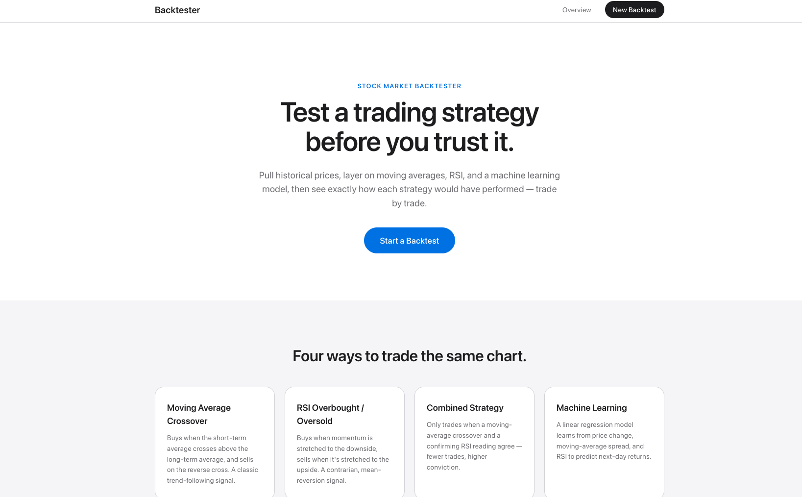
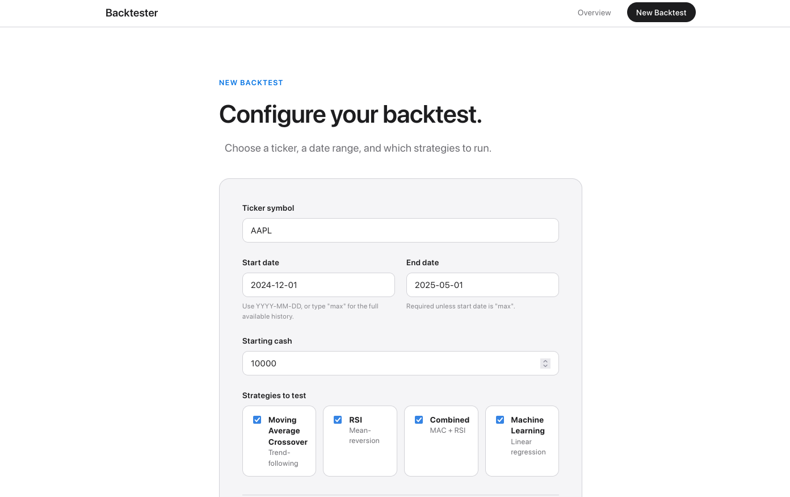
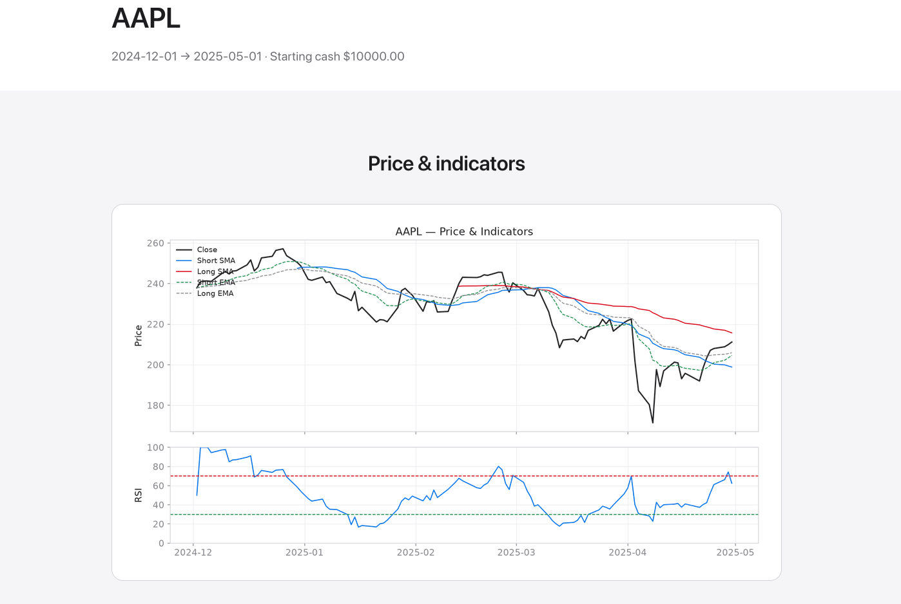
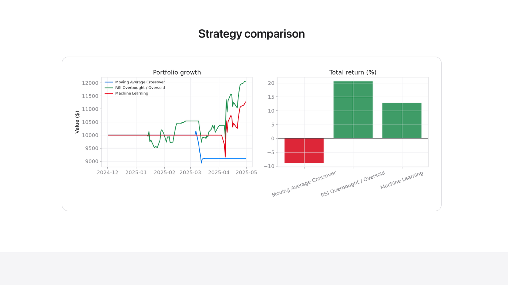
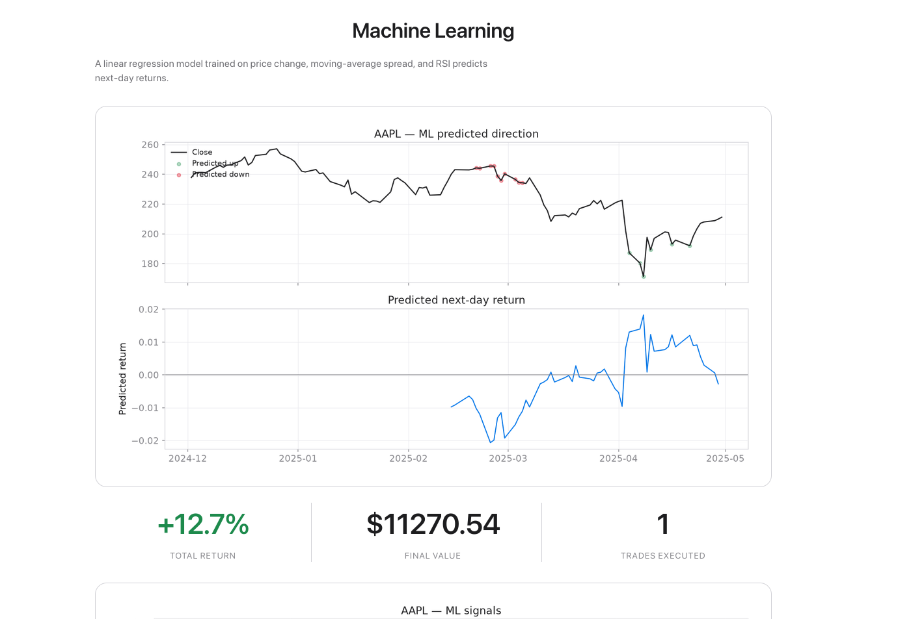

# Stock Market Analyzer & Backtester

A Python-based trading system that analyzes stocks, generates signals using
technical indicators and machine learning, and backtests strategies —
usable both as a command-line tool and through a Flask web dashboard styled
after apple.com.

## Screenshots

<p align="center">
  <br>
  <br>
  <br>
  <br>
  
</p>

## Features

- Fetch historical stock data via the yfinance API
- Calculate technical indicators (SMA, EMA, RSI)
- Multiple trading strategies:
  - Moving Average Crossover
  - RSI Overbought/Oversold
  - Combined Strategy
  - Machine Learning Predictions
- Backtest strategies on historical data
- Portfolio tracking and performance metrics
- Comprehensive visualizations
- Web Dashboard: Flask + HTML/CSS frontend with Overview, New Backtest
  (ticker, date range, starting cash, strategy selection, and advanced
  indicator settings), and Results (indicator chart, per-strategy signals
  and performance charts, a cross-strategy comparison, and the ML model's
  predicted-direction chart)

## Tech Stack

- Python 3
- Flask - Web frontend
- yfinance - Stock data
- Pandas - Data manipulation
- NumPy - Calculations
- scikit-learn - Machine learning
- matplotlib - Visualization

## Usage

### Command line

```bash
python main.py
```

### Web frontend

```bash
pip install -r requirements.txt
python app.py
```

Then open http://127.0.0.1:5000 in your browser. Data is fetched live from
Yahoo Finance on every backtest, so you'll need an internet connection each
time you run one. Desktop browsers only — no mobile layout.

## Project Structure

```
main.py                  - CLI entry point
app.py                   - Flask web app
requirements.txt
src/
  stock.py               - Stock data management
  indicator.py           - Technical indicator calculations
  strategy.py            - Trading strategy implementations
  portfolio.py           - Portfolio management
  backtester.py          - Backtesting engine
  ml_predictor.py        - Machine learning predictions
  visualizer.py          - CLI visualization tools (matplotlib windows)
templates/                - Flask HTML templates
static/css/style.css      - Web frontend styling
```

## Performance Metrics

- Total return %
- Number of trades
- Portfolio value over time

## Future Improvements

- Multi-stock portfolio support
- More ML models (Random Forest, LSTM)
- Risk management (stop-loss, position sizing)
- Real-time trading integration
- More technical indicators (MACD, Bollinger Bands)
